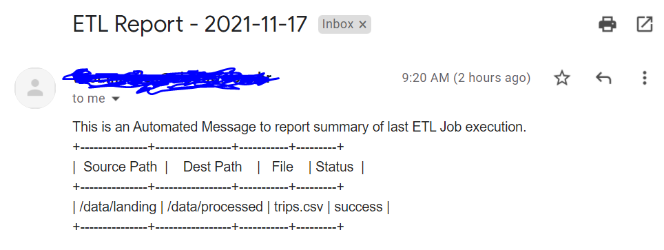
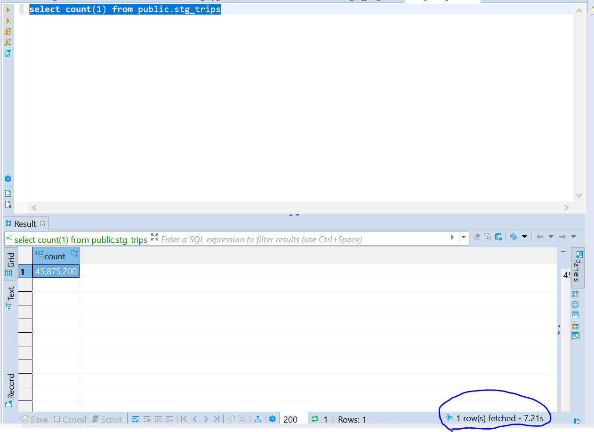
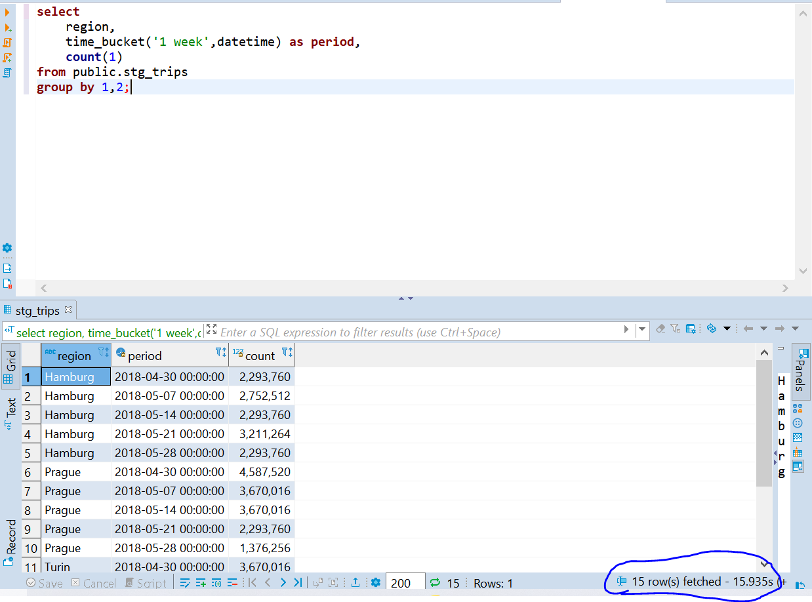
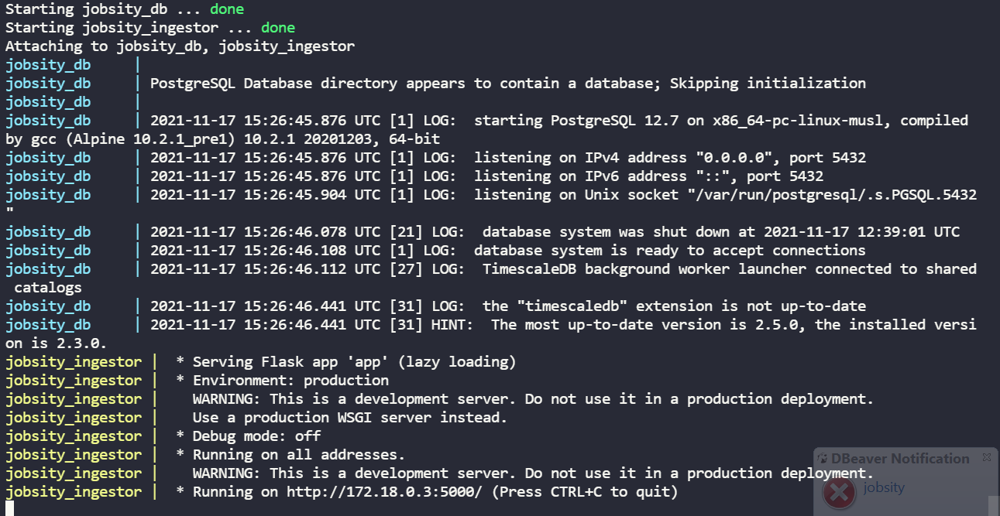

 

## Data Engineer Challenge

### Candidate Information

  | Owner        | Email Contact              | Contry |
|--------------|----------------------------|--------|
| Vitor Mendes | vitormendes120@hotmail.com | Brazil |

- [Data Engineer Challenge](#data-engineer-challenge)
  - [Candidate Information](#candidate-information)
- [About the Challenge](#about-the-challenge)
  - [Candidate Considerations](#candidate-considerations)
  - [Proposed Architecture](#proposed-architecture)
  - [Architecture Discussion](#architecture-discussion)
    - [Data Modelling](#data-modelling)
    - [Postgres TimescaleDB](#postgres-timescaledb)
    - [Postgres PostGIS](#postgres-postgis)
    - [Flask and Python - API](#flask-and-python---api)
    - [Docker](#docker)
  - [How it works?](#how-it-works)
  - [Test and Results](#test-and-results)
    - [Weekly Average number of trips - Performance](#weekly-average-number-of-trips---performance)
    - [Ingestion - Performance](#ingestion---performance)
  - [How to Setup](#how-to-setup)
    - [Initial Setup](#initial-setup)
    - [Environment Variables](#environment-variables)
    - [Docker Compose](#docker-compose)
  - [Sketch up on Cloud](#sketch-up-on-cloud)
    - [Would I migrate it to Cloud as Lift and Shift?](#would-i-migrate-it-to-cloud-as-lift-and-shift)
    - [Microsoft Azure](#microsoft-azure)
    - [AWS](#aws)

## About the Challenge

### Candidate Considerations

I tried to follow the exactly what the PDF document containing all the requirements was asking for. 

For example, it was asked to create a solution using SQL Databases. By SQL Databases I understand MySQL, Postgres or any other **relational database**.

In addition of that, one of the bonus question **asks to sketch up how I'd do the deploy of my solution in any cloud provider, or how I'd architect it using cloud native platforms.** Even I could do the entiure challenge using ***Platform as a Service*** tools on cloud (it would be a lot easier), I've supposed that the entire challenge should be done using Docker or any similar solution.

###  Proposed Architecture

 

###  Architecture Discussion

#### Data Modelling

The dataset is about Uber trips. It contains the region, origin coordinates, destination coordinates, a timestamp field about when it happened and which car attended that trip.

Since challenge's questions are about time oriented (e.g how many weekly trips occurred for a given region) and records doesn't have any unique key identifier, I've decided to model data in a **timeseries** way.

Using a **timeseries approach** will provide some benefits such as:

* Easily query data that requires time oriented filters
* Possibility to identify trends over time
* Great fit with predictive analytics

 

#### Postgres TimescaleDB

 

Postgres TimescaleDB is the leading open-source relational database with support for time-series data. It provides a lot of benefits such as:

* **Accelerated Performance**: Achieve 10-100x faster queries than PostgresSQL, InfluxDB and MongoDB.
* **Massive Scale**: It's possible to write millions of data points per second since it's horizontally scale.
* **ACID Support**: TimescaleDB is built on top PostgreSQL.

I've decided to use Postgre TimescaleDB since it complies to challenges mandatory features (Use a SQL Database). 

#### Postgres PostGIS

PostGIS is a spatial database extender for PostgreSQL object-relational database. It adds support for geographic objects allowing location queries to be run in SQL.

Some queries requires spatial and geometry oriented functions to be solved. Because of that I've decided to include PostGIS as part of my architecture solution.

#### Flask and Python - API

Flask is a Python web microframework which allow us to websites, Rest APIs etc...

A HTTP Trigger oriented Job was choosen since it's a easy way to invoke ETL process on demand. 

#### Docker

All the components described above are containerized, so it can easily be deployed anywhere.

I've built my own image for Data Ingestor (Flask API). It's available on DockerHub Registry.

Bellow are all images that's being used for this project.

* **TimescalDB**: *timescale/timescaledb-postgis:latest-pg12*
* **Data Ingestor**: *vitorhmendes97/jobsity-ingestor:latest*

###  How it works?

1) After setup is completed, Data Ingestor API will listen port **5000**. ETL processed are triggered when a **GET HTTP Resquest** is made in ```/ingest``` endpoint.

2) Once ETL ingestion is invoked, it will list each ```.csv``` in ```/data/landing``` directory. It's not a strict rule, but it's expected each file to have between 500mb - 2gb. 

3) A ```COPY``` command is invoked by TimescaleDB using pyscopg2 library, for every existing file in landing dir. A ```commit``` operation is done after each copy statement call, so if a failure happends while ingestion a csv file, it not impacts the previous ones. If you would like to see code in details, please go to ```IngestorCoordinator/database.py``` and check *load_into_table* function.

4) After tried to ingest every csv file, a notification report is sent by email for the email address filled in ```NOTIFICATION_EMAIL_USER_LOGIN``` environment variable. Please, notice that notification feature is not enable by default and it only works for GMAIL. In fact its requires ```NOTIFICATION_EMAIL_USER_LOGIN``` and ```NOTIFICATION_EMAIL_USER_PWD``` to work (you just need to specify them in our environment variables).

 

The above picture shows how the etl report looks like. Each line of the table correspond a status of ingestion for each file.

I know it's a very simple solution, but my main focus was to make sure the architecture is performing well.

5) If there are several files in landing dir, it will take some minutes to finish the ingestion process. A HTTP Response with status 200 will appear if everything was ok.

6) After csv files being ingested, a table in Postgres will be ready to serve that data. The table name is ```public.trips```. 

### Test and Results

Both containers were running in the same machine with 4 vCPU, 16GB RAM and SSD disk. For this challenge I used my personal notebook.

I replicated the original dataset in order to get several files with 5 million records each. I could not test with an input of 100 million rows since my machine do not have enough disk, but I was able to ingest 45 million rows. The following picture shows the total number of records for trips table.



#### Weekly Average number of trips - Performance

Since I've modeled that in a timeseries way and also I'm using TimescaleDB, I could achieve a very good performance (15.9 seconds) in this query which envolves basically a full scan in database + OLAP operations.

*OBS: Database cache feature was not enabled.*



#### Ingestion - Performance

Notice that Data Ingestor API is not resposible for write data into my Database, actually it just coordinate db actions. On db side, I've decided to use ```COPY``` command since it's database native and performs much better for bulk inserts than any other possible tool in this scenario like pandas dataframes.

It takes approx 1.3 minutes to ingest 5 million rows.

### How to Setup

#### Initial Setup
All containers are orchestrated by a ```docker-compose.yml``` file which is available in this github repository.

**Very Important**: Make sure to create the following directory structure before call docker-compose. The dir *data* is required and also its two child directories: *landing* and *processed*. 

```bash
├── data
│   ├── landing
│       └── trips.csv
│   └── processed
├── docker-compose.yml
```

Put all csv files inside ```data/landing```. All these directories will be mounted to container's internals folder.

#### Environment Variables

The bold ones are required env variables. All variables must be specified in docker-compose file.

* **POSTGRES_DB_HOST**: Postgre Host
* **POSTGRES_DB_USER**: DB username
* **POSTGRES_DB_PWD**: "DB User password"
* **POSTGRES_TABLE_NAME**: Postgres Table Name where data will be stored in. Default is *trips*.
* **INGESTION_FILE_PATH**: File path where landing csv files are stored. 
* **INGESTION_PROCESSED_PATH**: File path where processed csv file will me moved after being ingested.
* NOTIFICATION_EMAIL_USER_LOGIN: email address which will be used to sent and receive etl reports.
* NOTIFICATION_EMAIL_USER_PWD: email address password

**OBS**: Notification variables must be filled in order to report feature works. It only works with GMAIL SMTP protocol. When I developed it, I noticed that the email address owner must enable some configuration settings in his Google Account. I've done it, so I could make it work and show you guys a print how it looks like, but without its permissions enabled, this feature won't work.

#### Docker Compose

Make sure you have Docker and Docker Compose installed and your computer's port 5000 and 5432 are not being used. After that you can just call

```bash
docker-compose up
```


### Sketch up on Cloud

#### Would I migrate it to Cloud as Lift and Shift?

Please take notice that the architecture I've proposed here is based on challenge's mandatory features. It does not reflect what I'd do if I was in a cloud native scenario. Because of that, instead of saying how I'd migrate it to cloud, I prefer to redesign and rearchitect my solution, based on each cloud providers I'm experienced in.

#### Microsoft Azure

#### AWS