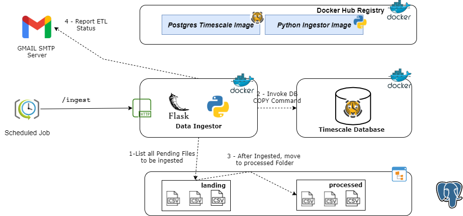
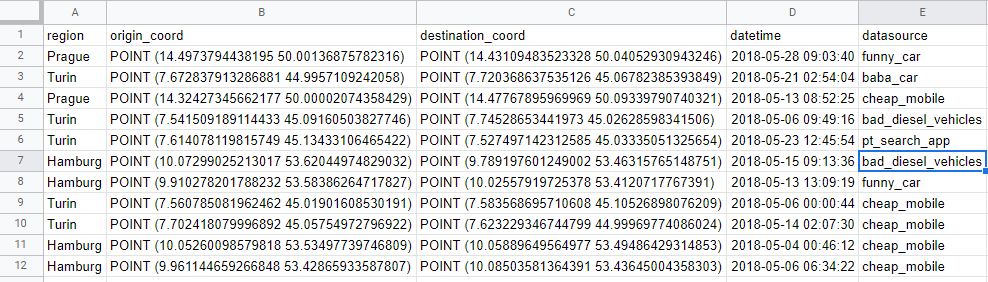

 

## Data Engineer Challenge

### Candidate Information

  | Owner        | Email Contact              | Contry |
|--------------|----------------------------|--------|
| Vitor Mendes | vitormendes120@hotmail.com | Brazil |

- [Data Engineer Challenge](#data-engineer-challenge)
  - [Candidate Information](#candidate-information)
- [About the Challenge](#about-the-challenge)
  - [Candidate Considerations](#candidate-considerations)
  - [Proposed Architecture](#proposed-architecture)
  - [Architecture Discussion](#architecture-discussion)
    - [Data Modelling](#data-modelling)
    - [Postgres TimescaleDB](#postgres-timescaledb)
    - [Postgres PostGIS](#postgres-postgis)
  - [Flask and Python - API](#flask-and-python---api)
  - [Docker](#docker)
  - [How it works?](#how-it-works)

## About the Challenge

### Candidate Considerations

I tried to follow the exactly what the PDF document containing all the requirements was asking for. 

For example, it was asked to create a solution using SQL Databases. By SQL Databases I understand MySQL, Postgres or any other **relational database**.

In addition of that, one of the bonus question **asks to sketch up how I'd do the deploy of my solution in any cloud provider, or how I'd architect it using cloud native platforms.** Even I could do the entiure challenge using ***Platform as a Service*** tools on cloud (it would be a lot easier), I've supposed that the entire challenge should be done using Docker or any similar solution.

###  Proposed Architecture

 

###  Architecture Discussion

#### Data Modelling

The dataset is about Uber trips. It contains the region, origin coordinates, destination coordinates, a timestamp field about when it happened and which car attended that trip.

Since challenge's questions are about time oriented (e.g how many weekly trips occurred for a given region) and records doesn't have any unique key identifier, I've decided to model data in a **timeseries** way.

Using a **timeseries approach** will provide some benefits such as:

* Easily query data that requires time oriented filters
* Possibility to identify trends over time
* Great fit with predictive analytics

 

#### Postgres TimescaleDB

 

Postgres TimescaleDB is the leading open-source relational database with support for time-series data. It provides a lot of benefits such as:

* **Accelerated Performance**: Achieve 10-100x faster queries than PostgresSQL, InfluxDB and MongoDB.
* **Massive Scale**: It's possible to write millions of data points per second since it's horizontally scale.
* **ACID Support**: TimescaleDB is built on top PostgreSQL.

I've decided to use Postgre TimescaleDB since it complies to challenges mandatory features (Use a SQL Database). 

#### Postgres PostGIS

PostGIS is a spatial database extender for PostgreSQL object-relational database. It adds support for geographic objects allowing location queries to be run in SQL.

Some queries requires spatial and geometry oriented functions to be solved. Because of that I've decided to include PostGIS as part of my architecture solution.

### Flask and Python - API

Flask is a Python web microframework which allow us to websites, Rest APIs etc...

A HTTP Trigger oriented ETL was choosen since it's a easy way to invoke ETL process on demand. 

### Docker

All the components described above are containerized, so it can easily be deployed anywhere.

I've built my own image for Data Ingestor (Flask API). It's available on DockerHub Registry.

Bellow are all images that's being used for this project.

* **TimescalDB**: *timescale/timescaledb-postgis:latest-pg12*
* **Data Ingestor**: *vitorhmendes97/jobsity-ingestor:latest*

###  How it works?

